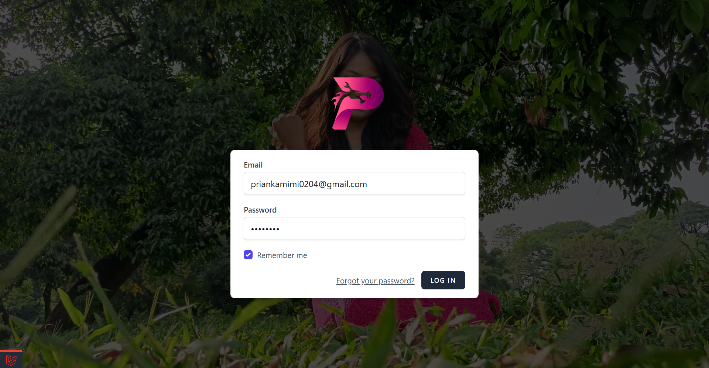
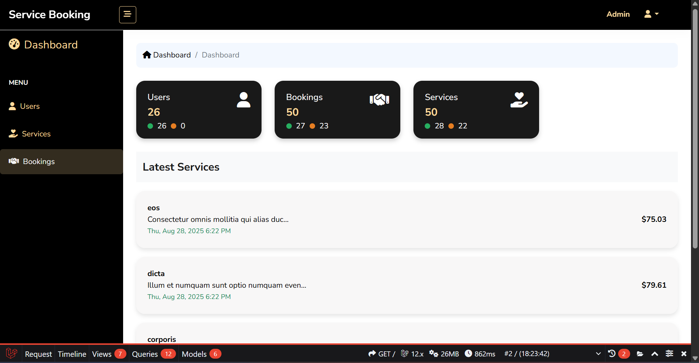
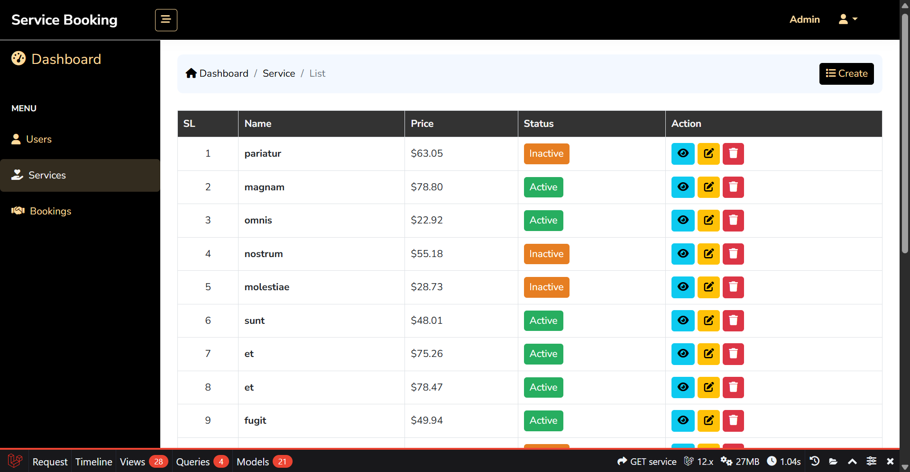
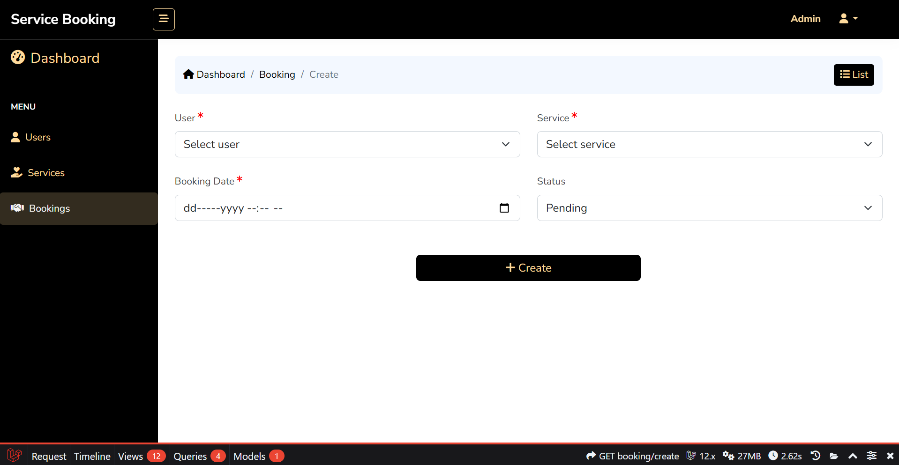
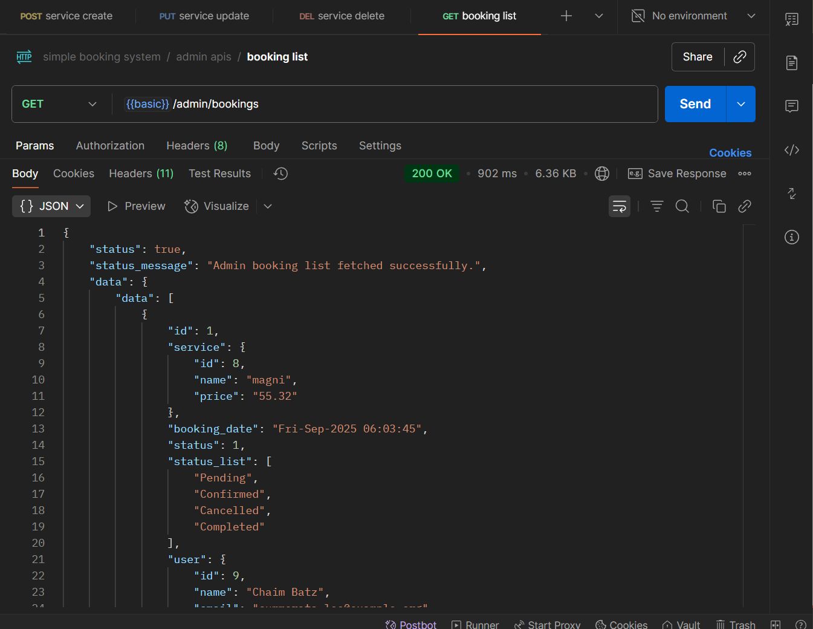

# Simple Service Booking System

A comprehensive Laravel-based service booking system with REST API endpoints for managing services and bookings. This project demonstrates clean architecture, proper separation of concerns, and professional Laravel development practices.

## Author

[Fatema Akther Prianka 🤗](https://github.com/Prianka-Mimi)

## 🚀 Features

### Admin Features
- **Service Management**: Create, update, delete, and list services
- **Booking Management**: View all customer bookings with detailed information
- **Dashboard**: Statistics overview with user, service, and booking counts
- **Admin Authentication**: Secure admin-only access to management features

### Customer Features
- **User Registration & Login**: Secure authentication system
- **Service Browsing**: View available services with pricing
- **Service Booking**: Book services with date/time selection
- **Booking History**: View personal booking history

### Technical Features
- **REST API**: Complete API endpoints for all operations
- **Role-based Access**: Admin and customer role separation
- **Optimized Queries**: No N+1 query problems, efficient database operations
- **Request Validation**: Dedicated request classes for data validation
- **Resource Classes**: API response formatting with Laravel Resources
- **Clean Architecture**: Model-Controller separation with business logic in models

## 🛠️ Technology Stack

- **Framework**: Laravel 12.x
- **Database**: MySQL
- **Authentication**: Laravel Sanctum (API tokens)
- **Frontend**: Blade Templates with Bootstrap
- **Development Server**: Laragon
- **API Testing**: Postman (Included the Json file for the API testing in folder screenshots)
- **Query Activities**: Telescope & laravel debugger

## 🔧 Installation & Setup

### Prerequisites
- PHP 8.1 or higher
- Composer
- MySQL
- Laragon/XAMPP/WAMP/Laragon

### Step 1: Clone Repository
```bash
git clone https://github.com/prianka-mimi/simple-service-booking-system.git
cd simple-service-booking-system
```

### Step 2: Install Dependencies
```bash
composer install
npm install && npm run build
```

### Step 3: Environment Configuration
```bash
cp .env.example .env
php artisan key:generate
```

Update `.env` file with your database credentials:
```env
DB_CONNECTION=mysql
DB_HOST=127.0.0.1
DB_PORT=3306
DB_DATABASE=simple_service_booking_system
DB_USERNAME=root
DB_PASSWORD=
```

### Step 4: Database Setup
```bash
php artisan migrate
php artisan db:seed 
```

### Step 5: Start Development Server
```bash
php artisan serve
```

Visit: `http://localhost:8000`

## 🔐 Default Admin Credentials
- **Email**: priankamimi0204@gmail.com
- **Password**: 12345678

## 📡 API Documentation

### Base URL
```
http://localhost:8000/api
```

### Authentication Headers
```
Authorization: Bearer {token}
Content-Type: application/json
Accept: application/json
```

### Public Endpoints

#### User Registration
```http
POST /api/register
Content-Type: application/json

{
    "name": "John Doe",
    "email": "john@example.com",
    "password": "password123"
}
```

#### User Login
```http
POST /api/login
Content-Type: application/json

{
    "email": "john@example.com",
    "password": "password123"
}
```

### Customer Endpoints (Authenticated)

#### Get Services List
```http
GET /api/services
Authorization: Bearer {token}
```

#### Book a Service
```http
POST /api/book-now
Authorization: Bearer {token}
Content-Type: application/json

{
    "service_id": 1,
    "booking_date": "2024-12-01 10:00:00",
    "status": 1
}
```

#### Get My Bookings
```http
GET /api/bookings
Authorization: Bearer {token}
```

### Admin Endpoints (Admin Only)

#### Create Service
```http
POST /api/services
Authorization: Bearer {admin_token}
Content-Type: application/json

{
    "name": "Web Development",
    "description": "Professional web development service",
    "price": 500.00,
    "status": 1
}
```

#### Update Service
```http
PUT /api/services/{id}
Authorization: Bearer {admin_token}
Content-Type: application/json

{
    "name": "Updated Service Name",
    "description": "Updated description",
    "price": 600.00,
    "status": 1
}
```

#### Delete Service
```http
DELETE /api/services/{id}
Authorization: Bearer {admin_token}
```

#### Get All Bookings (Admin)
```http
GET /api/admin/bookings
Authorization: Bearer {admin_token}
```

## 🏗️ Project Structure

### Models
- **User**: Handles user authentication, admin role management
- **Service**: Manages service CRUD operations with optimized queries
- **Booking**: Handles booking operations with user relationships

### Controllers
- **AuthApiController**: API authentication (register, login)
- **ServiceApiController**: Service management API endpoints
- **BookingController**: Booking management (web + API)
- **DashboardController**: Admin dashboard with statistics

### Request Classes
- **StoreServiceRequest**: Service creation validation
- **UpdateServiceRequest**: Service update validation
- **StoreBookingRequest**: Web booking validation
- **StoreBookingApiRequest**: API booking validation (no user_id required)

### Resources
- **UserDetailsResource**: User data formatting for API responses
- **ServiceListResource**: Service data formatting
- **BookingListResource**: Customer booking list formatting
- **BookingListForAdminResource**: Admin booking list with user details

### Key Features Implementation

#### Admin Role System
- `is_admin` boolean field in users table
- `isAdmin()` method in User model
- Admin checks in controllers before sensitive operations
- Proper error messages for unauthorized access

#### Optimized Database Queries
- Eager loading with `with()` to prevent N+1 problems
- Selective field loading with `select()` for performance
- Proper indexing on foreign keys and status fields

#### Clean Architecture
- Business logic in models, not controllers
- Controllers only handle HTTP requests and responses
- Dedicated request classes for validation
- Resource classes for consistent API responses

## 🧪 Testing the API

### Using Postman

1. **Register a new user**
   - POST `/api/register` with user details
   - Save the returned token

2. **Login as admin**
   - POST `/api/login` with admin credentials
   - Save the admin token

3. **Test admin endpoints**
   - Use admin token to create/update/delete services
   - Access admin booking list

4. **Test customer endpoints**
   - Use customer token to view services
   - Book services and view booking history

### Sample API Responses

#### Successful Response
```json
{
    "status": true,
    "status_message": "Service created successfully.",
    "data": {...},
    "status_code": 200,
    "status_class": "success"
}
```

#### Error Response
```json
{
    "status": false,
    "status_message": "Access denied. Admin permission required.",
    "data": null,
    "status_code": 403,
    "status_class": "failed"
}
```

## 📱 Web Interface

### Admin Panel Features
- Dashboard with statistics cards
- Service management (CRUD operations)
- Booking management with user details
- User list with email verification status

### Customer Features
- Service browsing with pricing
- Booking form with date/time selection
- Personal booking history

## 🔍 Code Quality Features

- **No N+1 Queries**: Optimized database queries with eager loading
- **Request Validation**: Separate request classes for each operation
- **Error Handling**: Comprehensive try-catch blocks with logging
- **Resource Classes**: Consistent API response formatting
- **Clean Controllers**: Minimal controller logic, business logic in models
- **Role-based Access**: Secure admin-only operations

## 📸 Screenshots







## 🤝 Contributing

1. Fork the repository
2. Create a feature branch
3. Commit your changes
4. Push to the branch
5. Create a Pull Request

## ✨ Contact

<div align="left">
  <a href="https://webdeveloperprianka.netlify.app/" target="_blank"> 
    
  </a>
  <a href="https://www.linkedin.com/in/fatema-akther-prianka/" target="_blank">
    
  </a>
  <a href="https://stackoverflow.com/users/23182049/prianka-mimi" target="_blank">
    
  </a>
  <a href="https://leetcode.com/u/prianka-mimi/" target="_blank">
  
  </a>
    <a href="mailto:priankamimi0204@gmail.com" target="_blank">
    
  </a>
  <a href="https://discord.com/channels/@me" target="_blank">
    
  </a>
  <a href="https://www.facebook.com/fatemaaktherprianka.webdeveloper" target="_blank">
    
  </a>
</div>
